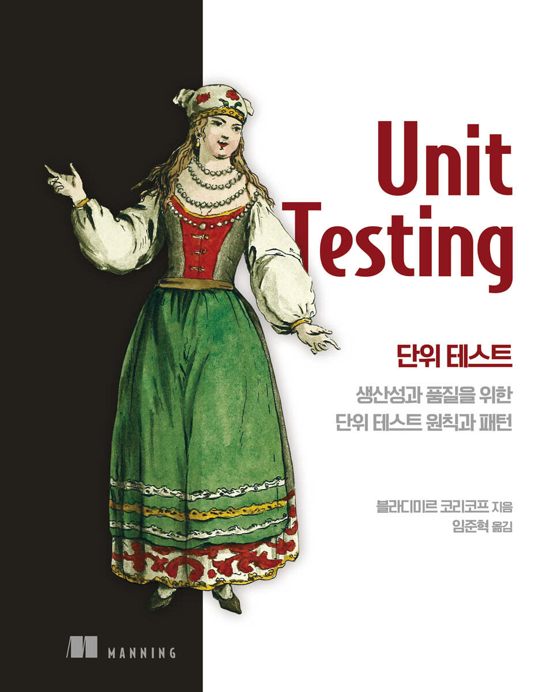

# 📖 단위 테스트: 생산성과 품질을 위한 단위 테스트 원칙과 패턴

## 📌 [책 정보](https://www.yes24.com/Product/Goods/104084175)
- **저자:** Vladimir Khorikov
- **역자:** 임준혁
- **출판년도:** 2021

## 🚀 진행 현황
- **시작 날짜:** 2025-02-21
- **완료 목표:** 2025-02-28
- **현재 상태:** ⏳ 진행 중

## 📚 목차
| 챕터 | 제목                                 | 상태 |
| ---- | ------------------------------------ | ---- |
| 1    | 단위 테스트의 목표                   | ❌   |
| 2    | 단위 테스트란 무엇인가?              | ❌   |
| 3    | 단위 테스트 구조                     | ❌   |
| 4    | 좋은 단위 테스트의 4대 요소          | ❌   |
| 5    | 목과 테스트 취약성                   | ❌   |
| 6    | 단위 테스트 스타일                   | ❌   |
| 7    | 가치있는 단위 테스트를 위한 리팩터링 | ❌   |
| 8    | 통합 테스트를 하는 이유              | ❌   |
| 9    | 목 처리에 대한 모범 사례             | ❌   |
| 10   | 데이터베이스 테스트                  | ❌   |
| 11   | 단위 테스트 안티 패턴                | ❌   |